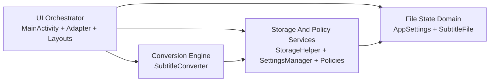
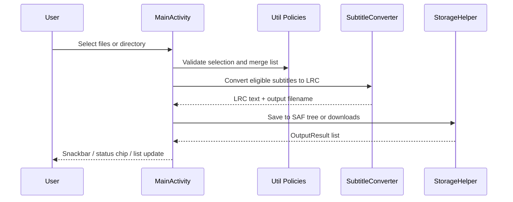

> generated_by: nexus-mapper v2
> verified_at: 2026-03-18
> provenance: Mermaid graph is inferred from manual import inspection plus README workflow; AST captured Kotlin structure successfully, but same-package imports were surfaced as external by query_graph in this run.

# Dependencies

## System Dependency Graph

Interpretation:
- `UI -> Conversion`：`MainActivity` 建立 `SubtitleConverter`，逐檔讀取內容並更新列表狀態。
- `UI -> Storage/Policy`：選檔規則、設定同步、來源目錄授權與輸出落地都由 util 層支撐。
- `Conversion -> Storage/Policy`：轉換器使用檔名/副檔名規則與設定值。
- `Storage/Policy -> Domain`：列表合併、設定持久化與保存結果都以 `SubtitleFile`、`AppSettings` 為資料模型。

## Runtime Flow

## Dependency Caveats

- `query_graph --hub-analysis` and `--summary` saw Kotlin modules and classes, but did not resolve internal `com.example.lrcapp.*` imports as internal edges in this environment.
- Because of that, downstream impact analysis is useful for file shape and hotspot context, but system-to-system arrows above are `inferred from file tree/manual inspection`.
- No evidence of cyclic multi-module architecture exists; the app is effectively a single-module View-based Android app with a very large orchestration Activity.
